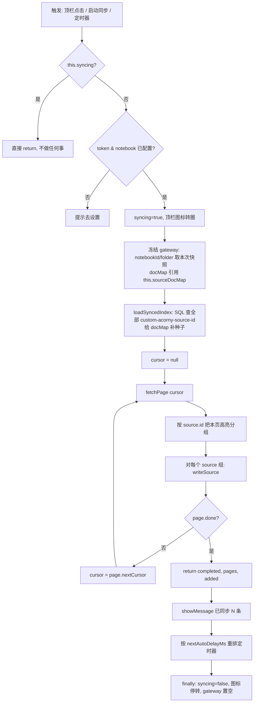
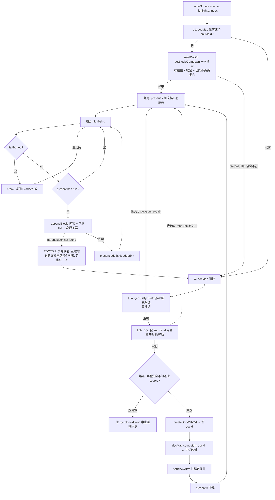

# 同步引擎逻辑详解（供 review）

**Date:** 2026-07-26（F/G/H 系列补充于 2026-07-27）
**代码基线:** `main`（PR #2 已合并，v1.1.0）
**目的:** 把「文档怎么建、内容怎么追加、怎么判重、怎么结束」逐条讲清楚，并列出实测确认的缺陷。

> 📌 **只想知道「哪些内核 API 不能按直觉用」？直接看 [`../SIYUAN_KERNEL_CONTRACT.md`](../SIYUAN_KERNEL_CONTRACT.md)。**
> 本文是完整的设计说明与事故复盘，篇幅较长。
>
> ✅ **§7 的 D-1 ~ D-4、D-7、D-8 已修复**（见 §10 修复记录）。§1–§6 描述的逻辑现已与代码一致；
> §7 保留为事故档案，说明缺陷是什么、为何三轮修复没能命中它。

---

## 1. 组件与职责

```
┌──────────────────────────────────────────────────────────────┐
│ index.ts  (AcornySyncPlugin)                                 │
│  · 设置持久化 / 顶栏按钮 / 定时器                              │
│  · this.syncing       插件级单飞门（挡并发点击）                │
│  · this.sourceDocMap  source→docId 映射（持久化在 data.json）   │
└───────────────┬──────────────────────────────────────────────┘
                │ 每次 runSync 冻结一次 gateway（notebook/folder 快照）
                ▼
┌──────────────────────────────────────────────────────────────┐
│ syncEngine.ts  (SyncEngine)                                  │
│  · 只管「翻页 + 按 source 分组 + 计数 + 错误分类」               │
│  · 不认识思源，全部落库动作走 deps.writeSource                  │
└───────┬──────────────────────────────────┬───────────────────┘
        │ deps.fetchPage                   │ deps.writeSource / loadSyncedIndex
        ▼                                  ▼
┌────────────────────┐          ┌──────────────────────────────┐
│ apiClient.ts       │          │ siyuanGateway.ts             │
│ Acorny Export API  │          │  · resolveDoc    建/复用文档   │
│ (走 forwardProxy)  │          │  · writeSource   追加高亮块    │
└────────────────────┘          └──────────┬───────────────────┘
                                           ▼
                                ┌──────────────────────────────┐
                                │ siyuanClient.ts → kernel API │
                                └──────────────────────────────┘
```

**关键分层原则:** `SyncEngine` 对「思源」零认知；所有存在性判断都在 `siyuanGateway` 里。这样引擎可以纯单测，网关的正确性只依赖若干 kernel API 的真实契约（§5），这些契约全部真机实测、并由 `scripts/kernel-e2e-probe.mts` 可复跑验证。

---

## 2. 一次 sync 的完整时序



### writeSource 内部（每个 source 一次）



---

## 3. 逐条回答你的问题

### Q1. 怎么判断"已经有了对应的文件"？

**四级下降，都不看文件名。任一级命中都不会新建。**

| 级 | 数据来源 | 索引延迟 | 会不会被截断 | 覆盖什么 |
|---|---|---|---|---|
| L1 `docMap` | `this.sourceDocMap`，**持久化在 data.json** | 无 | 否 | 主路径；连点/重启都命中 |
| L2 批量种子 | `SELECT ... WHERE name='custom-acorny-source-id' LIMIT 100000` | **1–2s** | 触顶即**中止同步** | 补齐 docMap（data.json 丢失后的整体恢复） |
| L3a **按路径查** | `getIDsByHPath(notebook, /folder/<标题>)` | **零延迟** | 否 | 刚建完、attributes 表还没索引的 1–2s 窗口 |
| L3b **按属性点查** | `SELECT ... AND value='<sourceId>' LIMIT 8` | 1–2s | **不可能**（WHERE 过滤，结果集恒小） | 用户把文档**改名/移走**了 |
| 校验 | `getBlockKramdown(docId)` | **零延迟** | — | 存在性 + 锚定 + 已同步高亮，一次读全 |

**判定式**（`siyuanGateway.ts` `resolveDoc`）：
```
readDocOf(docId, sourceId):
    kramdown = getBlockKramdown(docId)
    空串                           → null（文档不存在）
    解析出的 source-id ≠ sourceId  → null（锚定不符：同名他源 / 被改）
    否则                           → 该文档已同步的高亮 id 集合

L1 → L3a → L3b 依次尝试，每个候选都过 readDocOf；全不中才 createDocWithMd
```

**存在性判据为什么只能是 kramdown**（2026-07-26 真机实测）：

| 场景 | `getBlockKramdown` | `getBlockAttrs` |
|---|---|---|
| 空文档（存在、无内容） | 非空（含文档根块 IAL） | 有属性 |
| 有内容（存在） | 非空 | 有属性 |
| **已删除** | **空串，立即生效** | **仍长期返回完整属性** |
| id 根本不存在 | 空串 | — |

`getBlockAttrs` 对已删文档不会变空，**不能**判存在性。曾据此把已删文档当成还在，`appendBlock` 报 `parent block not found`，整轮同步退避 60s。该方法已从 `SiyuanClient` 接口移除，避免再被误用。

**L3a / L3b 为什么都必须存在:** `docMap` 未命中 **≠** 文档不存在（data.json 丢失、种子失效、上次建档后没落盘都会造成未命中），而 `createDocWithMd` 非 hpath 幂等——少了这两级，任何一次索引失效都会直接变成重复建档。事故（§7）正是死在这里。两级分工互补：L3a 零延迟但认标题，L3b 认属性但滞后 1–2s。

**TOCTOU 兜底:** 读完 kramdown 之后、追加之前用户仍可能删掉文档。`appendBlock` 报 `parent block not found` 时，`writeSource` 重建文档并**对新文档重跑整个高亮列表**（不能接着写——先前因"旧文档里已有"而跳过的高亮在新文档里并不存在），最多重来一次。

**刻意不用文件名当唯一键的原因:** `createDocWithMd` **非** hpath 幂等（同路径连建两次得到两个不同 docId，思源允许同名文档）。L3a 按路径查只是**找候选**，命中后一律用锚定属性校验，因此同名不同源不会串数据。

### Q2. 怎么在一个文件里 append 内容？

`appendBlock(docId, markdown)` → `/api/block/appendBlock`，`parentID` 传文档根块 id，追加到文档末尾。

每条高亮渲染成（`renderer.ts:36`）：
```markdown
* 高亮正文 #tag1# #tag2#
  * note: 批注内容
{: custom-acorny-id="<highlight-uuid>"}
```
最后一行是**内联 IAL**。实测（fixtures 结论 1）该属性会落在外层 `data-type="NodeList"` 块上，`data[0].doOperations[0].id` 返回的正是这个块。

**为什么把 id 塞进同一次 append，而不是 append 完再 setBlockAttrs：** 避免"块已写入但属性没写成"的崩溃窗口——那会造成一条高亮永远判不出已同步、每次同步重复追加。现在是一次事务原子落地。

### Q3. 怎么判断是否 sync 完毕？

**服务端说了算。** `ExportFeedResponse.done`：

```
cursor=null → fetchPage → done=false → cursor=nextCursor → fetchPage → ... → done=true → 停
```

三个额外的退出闸门（`syncEngine.ts:54-66`）：
- `isAborted()`（插件被禁用/卸载）→ 每次 fetch 前、每个 source 组前都查一次，命中返回 `{status:'skipped'}`
- `pages >= MAX_PAGES`(10000) → 防服务端 bug 导致的无限翻页
- 抛异常 → 走 catch，分类成 `auth_failed` / `backoff`

**注意:** 引擎**不**持久化游标。每次同步都从 `cursor=null` 重新拉整个 feed（"全量对账"）。这是 Q4 能成立的前提。

### Q4. 删掉一个文件，怎么知道是哪个被删了？

**不需要知道。** 这是全量对账模型的核心：插件从不"检测删除"，而是**每次同步都把完整 feed 过一遍，逐个问思源"这条还在不在"**。

```
增量游标模型（v1.0.0，已废弃）        全量对账模型（当前）
────────────────────────────        ──────────────────────────
存 cursor=上次的 updatedAt          不存 cursor
只拉 updatedAt > cursor 的高亮       每次拉全部高亮
                                    
用户删了文档                         用户删了文档
  → 该高亮 updatedAt 没变             → 下次同步照样拉到它
  → 永远不再出现在 feed 里             → getBlockKramdown 返回空串
  → ❌ 永远回不来                      → ✅ 重建文档 + 重灌高亮
```

代价：每次同步都是全量拉取 + 每个 source 一次 `getBlockKramdown`（存在性 / 锚定 / 去重合并成这一次读）。446 个 source ≈ 446 次本地 kernel 调用/次同步；只有 docMap 未命中的 source 才会多付 L3a/L3b 各一次。本地调用，可接受，但不是零成本。

**局限（需要你知道）:** 只能恢复"整篇被删"和"整篇里少了某几条高亮"。**删掉的是一整篇但你又不想要它** → 下次同步它还会回来。目前没有"忽略这个 source"的机制。

### Q5. 多次点击 sync 怎么保证不重复建文件？

五道闸，从外到内：

| # | 位置 | 挡什么 | 代码 |
|---|---|---|---|
| 1 | `this.syncing` | 插件级单飞：第二次点击直接 return，连 gateway 都不建 | `index.ts:108` |
| 2 | `SyncEngine.running` | 引擎级单飞（兜底，理论上被 #1 拦在前面） | `syncEngine.ts:39` |
| 3 | `docMap` 映射（持久化） | **跨同步 + 跨重启**存活。第二次同步不查 SQL 就知道文档 id，绕开 1–2s 索引延迟 | `index.ts` |
| 4 | `readDocOf` 校验 | 零延迟确认文档真的还在且锚定正确，防 docMap 指向已删块 | `siyuanGateway.ts` |
| 5 | L3a/L3b 建档前查找 | docMap 整体失效时仍能找回已有文档 | `siyuanGateway.ts` |

第 1 道是"同一时刻"防线，第 3 道是"秒级连点"防线——后者是上一轮修复的重点：**只有 #1 而没有 #3 的话**，第一次同步完成 → 1 秒内再点 → `loadSyncedIndex` 的 SQL 还没索引到刚写的属性 → 全部重建。

> 🔴 但 #3 只在**同一个插件会话内**有效，且它的冷启动种子来自 #2 那条被截断的 SQL。见 §7。

### Q6. 每个 sync 任务是怎么结束的？

`runSync` 的 `finally` 块（`index.ts:139-143`）无条件执行三件事：

```
finally {
  this.syncing = false        // 放开单飞门
  setSyncingIndicator(false)  // 顶栏图标停转
  this.activeGateway = null   // 释放本次的目的地快照
}
```

正常/异常/abort 三条路径都过这里，所以不存在"卡住再也点不动"的状态。

结束后按 `nextAutoDelayMs` 重排定时器（`scheduler.ts`）：

| 结束状态 | 下次自动同步 |
|---|---|
| `completed` | 常规 interval（`pollIntervalMinutes`，0 = 关闭） |
| `skipped` | 常规 interval |
| `backoff` | `retryAfterSeconds` 后重试（**但自动同步关闭时不重试**，尊重设置语义） |
| `auth_failed` | `null` —— 停掉自动同步，直到用户手动点一次 |

### Q7. 遇到已经存在的文件怎么处理？

**复用，不覆盖，不重建，只做增量追加。**

```
已存在文档 docId
  → getBlockKramdown(docId)                 读整篇当前内容
  → parseSyncedHighlightIds(kramdown)       正则扫出所有 custom-acorny-id
  → 对 feed 里的每条高亮:
       在集合里 → 跳过（added 不增加）
       不在     → appendBlock 追加到末尾
```

**用户在文档里手写的内容不会被动**——插件只 append，从不 delete/update 已有块。

`parseSyncedHighlightIds` 用了前置边界 `(?<![-\w])`，确保文档锚定属性 `custom-acorny-source-id` 不会被误认成某条高亮的 `custom-acorny-id`（否则 id 为 `source-id` 的高亮会被永久跳过）。

**为什么读 kramdown 而不是查 SQL:** kramdown 由实时块树生成，**无索引延迟**——本次同步刚 append 的块，同一次同步里立刻可见。SQL `attributes` 表要等 ~1.5s。

---

## 4. 状态存在哪里

| 状态 | 位置 | 生命周期 | 丢了会怎样 |
|---|---|---|---|
| 用户设置 | `data.json`（`saveData`） | 永久 | 需重新配置 |
| `sourceDocMap` | `data.json`，每次同步结束**无条件**落盘 | 永久 | 退化到 L2 种子 / L3 点查，仍不会重复建档 |
| 已同步高亮 id | **不存**，每次从文档 kramdown 现读 | — | 不适用 |
| 同步游标 | **不存**（全量对账） | — | 不适用 |
| `syncing` / `activeGateway` / 熔断计数 | 内存 | 单次同步 | 不适用 |

落盘放在 `runSync` 的 `finally` 里，成功/失败/中止/卸载四条路径都会执行——**已经建出来的文档必须被记住**，否则下次同步会认为它们不存在并再建一遍（这正是事故的放大路径）。

设计原则：**没有任何单一数据源是真相**。docMap 会过期（用 `getBlockAttrs` 实时校验），种子会被截断（触顶即中止），点查是精确但慢的兜底。三者互为后备，且任何一层出问题的后果都是**停下来报错**，而不是造脏数据。

---

## 5. kernel API 契约（全部实测，非文档推测）

| API | 用途 | 实测行为 | 索引延迟 |
|---|---|---|---|
| `/api/filetree/createDocWithMd` | 建文档 | 返回 docId 字符串。**非 hpath 幂等**：同路径连建 = 两个文档 | — |
| `/api/block/appendBlock` | 追加块 | 内联 IAL 落在 NodeList 块上；id 在 `data[0].doOperations[0].id` | — |
| `/api/attr/setBlockAttrs` | 打锚定属性 | 正常 | 写入 SQL 表要 ~1.5s |
| `/api/attr/getBlockAttrs` | 判文档存在 | 已删除块返回 `code:0, data:{}`（**不抛错**） | **无延迟** |
| `/api/block/getBlockKramdown` | 判高亮存在 | 已删除块返回 `code:0, data.kramdown:""` | **无延迟** |
| `/api/query/sql` | 冷启动种子 | 🔴 **无显式 LIMIT 时默认只返回 64 行** | ~1.5s |
| `/api/network/forwardProxy` | 调 Acorny API | headers 值是**数组** `{"Content-Type":["..."]}`，已在 `httpProxy.ts` 扁平化 | — |

实测证据（2026-07-26，本机 kernel 3.7.3，只读）：
```
SELECT id FROM blocks                 → 64 行
SELECT id FROM blocks LIMIT 100000    → 100000 行
SELECT count(*) FROM blocks           → 103754
```

---

## 6. 当前实际数据状态（2026-07-26 实测）

```
真实 source 数（distinct）      446
Acorny 文档数                  6850     ← 应该是 446
有重复文档的 source            397/446
单个 source 最多重复           88 篇（"Rigid Body Collision — NVIDIA PhysX SDK"）

distinct 高亮 id               990
高亮块总数                     16409    ← 应该是 990
```

同一 source 的重复文档 id 呈**等间隔时间戳**（13:43 / 14:06 / 14:13 / 14:36 / 15:01 / 15:25 / 15:51 …），即**每一次自动同步产生一份新副本**。两次探测间隔数秒，行数从 6843 涨到 6850——**当时插件仍在持续复制**。

---

## 7. 🔴 已确认缺陷清单

### D-1（致命，根因）`loadSyncedIndex` 的 SQL 被内核默认 LIMIT 64 截断

**位置:** `siyuanGateway.ts:36-38`
```ts
const rows = await client.querySql<AttrRow>(
  "SELECT block_id, value FROM attributes WHERE name = 'custom-acorny-source-id'",
)   // ← 没有 LIMIT
```

**机制:** 思源 `/api/query/sql` 对无显式 `LIMIT` 的语句施加默认上限 **64 行**。用户有 446 个 source，因此 docMap 的冷启动种子**永远只有 64 条**，其余 382 个 source 在每次冷启动后的第一次同步都被判为"从没同步过"：

```
loadSyncedIndex 拿到 64 行 (of 446)
   ↓
source #65..#446 → docMap 未命中
   ↓
createDocWithMd → 新文档（思源允许同名，不会失败）
   ↓
getBlockKramdown(新文档) → 空 → present 为空集
   ↓
该 source 的全部高亮重新 append 一遍
```

**为什么之前三轮修复没治好:**
- 「全量对账」改的是 feed 侧（能拉到被删的高亮），没碰 SQL 截断
- 「docMap 无延迟去重」只在**同一会话内**有效；而它的初始值恰恰来自这条被截断的查询
- 旧版（v1.0.0）每次同步都直接用 SQL 判重，等于**每次同步**都触发一轮，正好对应观测到的等间隔副本

**修复:** 语句加显式 `LIMIT`（内核实测支持 100000），并且**必须校验返回行数是否触到上限**——静默截断正是这次事故的形态，不能只是把 64 换成一个更大的魔数。同理需要审计仓库里所有 `querySql` 调用点（当前只有这一处）。

### D-2（高）`sourceDocMap` 不持久化，跨重启完全依赖 D-1 那条查询

**位置:** `index.ts:43`、`index.ts:255`（`persist()` 只存 `{settings}`）

即使 D-1 修好，每次思源重启仍要靠一次 SQL 全表扫来重建映射；且该表有 ~1.5s 索引延迟。**若启动同步（`syncOnStartup`）在内核索引就绪前触发，同一场景会重演。** 应把 docMap 持久化进 `data.json`，SQL 只作兜底修复，并且在种子结果明显异常（例如行数远小于上次持久化的条目数）时**拒绝同步并报错**，而不是闷头建新文档。

### D-3（高）没有任何"重复即异常"的护栏

现在的代码把「查不到 → 建新文档」当成完全正常的路径，没有任何一处会说"等一下，我上次明明有 446 篇，这次只看到 64 篇"。一个静默的数据源截断因此直接放大成 6850 篇文档。

**修复方向:** 建文档前做一次一致性断言（种子条目数 vs 上次持久化条目数），偏差超阈值就中止同步并提示用户，宁可不同步也不要制造脏数据。

### D-4（中）`SiyuanClient.createDocWithMd` 的 JSDoc 是错的

**位置:** `siyuanClientCore.ts:14` —「同 hpath 幂等，不覆盖已有内容」

与 `docPath.ts:50` 的实测结论（**非**幂等）直接矛盾。任何相信这条注释的人都会以为"重复建同名文档是安全的"。必须改掉。

### D-5（中）已经产生的 6850 篇重复文档，插件永远不会清理

`loadSyncedIndex` 对同一 source 的多行只取任意一行（`if (!(r.value in opts.docMap))`），其余副本变成孤儿：不再被写入，也不会被删除，而且每次冷启动"胜出"的可能是不同的副本，导致新高亮散落在不同副本里。

**需要一次性清理脚本**（按 source 保留高亮最多的一篇，其余删除），且清理必须在 D-1/D-2/D-3 修好之后做，否则边清边生。

### D-6（低）成本

每次同步对每个 source 各 1 次 `getBlockAttrs` + 1 次 `getBlockKramdown`，446 source ≈ 892 次本地调用；`getBlockKramdown` 拉的是整篇文档全文。目前可接受，但随高亮量线性增长。

---

## 8. 修复顺序（已执行）

```
1. 立即：在思源里禁用 Acorny 插件            ← 止血，防止继续复制
2. 修 D-1（SQL LIMIT + 截断检测）
3. 修 D-3（一致性护栏：种子异常就拒绝同步）    ← 这条比 D-1 更重要，
                                              它是"下一个未知的 D-1"的保险
4. 修 D-2（docMap 持久化）
5. 修 D-4（注释）
6. 写清理脚本，处理存量 6850 篇              ← 必须在 2-4 上线后
7. 回归测试：造 >64 个 source 的场景跑冷启动同步，断言文档数不增长
```

第 7 步是这次事故最该补的测试——出事前的 50 个单测全绿，但**没有任何一个测试的 source 数超过 3 个**，所以 64 这条线从未被触碰过。这是典型的"虚假信心"：测试覆盖了逻辑分支，却没覆盖真实数据规模。

---

## 9. 相关文件

| 文件 | 职责 |
|---|---|
| `src/index.ts` | 插件生命周期、设置、定时器、单飞门、docMap 宿主 |
| `src/syncEngine.ts` | 翻页 / 分组 / 计数 / 错误分类 |
| `src/siyuanGateway.ts` | 文档解析与创建、高亮去重与追加 ← **D-1 在这里** |
| `src/siyuanClient.ts` | kernel HTTP 调用 |
| `src/siyuanClientCore.ts` | 纯逻辑：`parseSyncedHighlightIds`、id 提取 ← **D-4 在这里** |
| `src/docPath.ts` | 标题清洗 → hpath |
| `src/renderer.ts` | 高亮 → markdown + 内联 IAL |
| `src/scheduler.ts` | 下次自动同步的延迟决策；`mayRunSync`（初始化门槛）、`pickNotebookValue`、`readInitedFlag` |
| `src/folderMigration.ts` | 位置对账 `findDocsOutsideFolder`、迁移 `migrateDocsToFolder`、历史文件夹 `rememberFolders` |
| `src/apiClient.ts` | Acorny Export API 客户端；`retryTransient` / `isTransientFeedError` 瞬时故障重试 |
| `scripts/kernel-e2e-probe.mts` | 真实内核端到端探针（手动跑） |
| `docs/SIYUAN_KERNEL_CONTRACT.md` | **内核契约速查 + 通用教训（改同步逻辑前先读）** |
| `docs/superpowers/notes/2026-07-23-kernel-contract-fixtures.md` | 首次 spike 的原始记录（2026-07-23，仅存档；以速查表为准） |

---

## 10. 修复记录（2026-07-26）

| 缺陷 | 修法 | 回归测试 |
|---|---|---|
| **D-1** 种子查询被静默截断到 64 行 | 查询加显式 `LIMIT 100000`；**触顶即抛 `SyncIndexError('seed_truncated')` 中止同步**，不拿残缺索引继续跑。另在 `SiyuanClient.querySql` 的 JSDoc 上写明这个内核行为 | `seeds every source beyond the kernel default row cap`（100 个 source 冷启动，断言零新建）<br>`throws instead of silently proceeding when the seed query hits its row limit` |
| **D-1 根治** 建档前无精确确认 | 新增 **L3 点查** `findDocBySourceId`：docMap 未命中时，针对该 source 精确查一次再决定建不建。带 `WHERE` 的小结果集，结构上不可能被批量截断 | `falls back to a point lookup before creating, so a lost docMap never duplicates existing docs`<br>`escapes the source id in the point lookup instead of interpolating it raw` |
| **D-2** docMap 不持久化 | 写入 `data.json`（`PersistShape.sourceDocMap`），在 `runSync` 的 `finally` 里**无条件**落盘 | — |
| **D-3** 无"重复即异常"护栏 | 熔断 `chargeUnknownSourceCreate`：只对「索引声称完全不知道该 source、却要建档」计费，预算 `max(50, baseline)`，超限抛 `SyncIndexError`。新增 `index_error` 状态 → `nextAutoDelayMs` 返回 `null`（**停掉自动同步**，不重试），并弹出 20s 错误提示 | `aborts the sync once new-doc creations blow past the budget`<br>`lets a full rebuild through after the user purged every doc`<br>`does not apply the budget on a first-ever sync`<br>`index_error → null` |
| **D-4** `createDocWithMd` JSDoc 说反了 | 改为明确写「**非** hpath 幂等」并指向 spike 记录 | — |
| **D-5** 存量 6850 篇重复 | **无需脚本**：用户已手动清空（实测 `custom-acorny-*` 属性归零，总块数 103754 → 30497） | — |

### D-7（致命）`getBlockAttrs` 被当成存在性判据 —— 已修

**症状:** 删掉一篇已同步文档后点同步 → `parent block not found: <docId>` → 整轮同步中断并退避 60s。

**根因:** `getBlockAttrs` 对**已删除**文档仍然长期返回完整属性（实测删除后 +0s / +0.5s / +3s 均返回），所以 `resolveDocId` 认为文档还在、直接复用，`appendBlock` 才发现父块没了。上一份 spike 记的「删除→返回空 `{}`」是错的。

**修复:** 改用 `getBlockKramdown`——删除后**立即**返回空串，而"存在但没内容"的文档仍返回根块 IAL（非空），两者可区分。同时把存在性、锚定校验、高亮去重合并进这一次读取，每个 source 少一次 kernel 调用。`getBlockAttrs` 已从 `SiyuanClient` 接口移除。另加 TOCTOU 兜底：`appendBlock` 报父块不存在时重建并重跑该 source。

### D-8（高）刚建档的 1–2 秒窗口内冷启动仍会重复建档 —— 已修

**发现方式:** 端到端探针（`scripts/kernel-e2e-probe.mts`，跑真实网关代码打真实内核）抓到——建完文档立刻清空 docMap 再同步，**又建了一篇**。

**根因:** `attributes` SQL 表的索引延迟实测为 1–2s（+415ms 与 +962ms 查不到，+2013ms 才有）。L2 种子和 L3b 点查都查这张表，那段窗口里 docMap 若恰好为空（data.json 丢失 / 刚重载），两条通道同时失明。

**修复:** 新增 **L3a** `getIDsByHPath` 按路径查——实测**零延迟**（+415ms 即返回）。命中的候选仍用锚定属性校验，故思源允许的同名文档不会串数据。修复后同一探针在**零等待**条件下 8/8 通过。

**熔断的计费口径为什么是「索引查不到」而不是「所有新建」:** 最初按所有新建计费，导致「用户清空整个 Acorny 文件夹后重新同步」被误判为异常——重建量必然 ≥ 原基线。而这类新建有正面证据（docMap 有条目 + `getBlockAttrs` 实时核实文档确已删除），属合法重建。真正的失效 signature 是「索引条目凭空消失」，只该对它计费。

单测 50 → 129，全部通过；lint / typecheck / build 全绿。

### 后续几轮修复（G / H 系列，2026-07-27）

前面几轮修的都是「重复建档」这条链。上线后用户实测又暴露出另外几类问题，
共同点是**我把本该状态驱动的东西写成了事件驱动，或者凭代码推演而没有看真实数据**。

| 编号 | 缺陷 | 修法 |
|---|---|---|
| **G-1** | 笔记本下拉在用户没碰过时被「所见即所存」写进 draft，目标笔记本被静默定死 | 新增「请选择笔记本」空占位；回写抽成 `pickNotebookValue` |
| **G-2** | 启动同步 / 定时同步 / 保存后同步都不检查目的地是否被确认过，「填个 token 点保存」就开始写入 | 新增持久化 `inited`：用户亲自跑过一次同步之前，三条自动路径全部不跑。`inited`（客观事实）与 `syncOnStartup`（用户偏好）**必须是两个变量** |
| **G-3** | `pickNotebookValue` 的前身在列表未加载时无条件回写，把持久化的 `notebookId` 清成空——界面显示「未选择」，一点保存就真的丢配置 | 列表为空（未加载）时原样保留 |
| **G-4** | 思源卸载插件**不删** `data/storage/petal` 下的数据，「删掉重装」不会回到未初始化状态 | 设置页提供「重置初始化」按钮 |
| **H-1** | 迁移只在 `planDestinationChange` 检测到**设置变更**时安排一次。设置成 A、文档在 B 之后，再点多少次保存都判定「没变化」，永久对不上 | 改为**状态驱动**：新增 `findDocsOutsideFolder`，每次同步一次联表查询实测「哪些文档不在目标位置」，不一致就搬。删除 `migrationPending` 与 `needsMigration` |
| **H-2** | 一页翻页失败就让整轮同步作废并退避 60 秒（真机遇到 `net/http: TLS handshake timeout`） | `retryTransient`：4 次尝试、1s/2s/4s 退避；401/429/其它 4xx 不重试；`forwardProxy` 超时 15s → 30s |
| **H-3** | 通用异常兜底只把原因交给 `onStatus`，而它在 `index.ts` 里是空函数——弹窗只说「已延后 60s」 | `backoff` 结果带上 `reason`，弹窗显示原因 |

**H-1 与当年的增量游标是同一类错误**：同步早已改成全量对账，迁移却还停在一次性事件。
凡是「配置声明的目标状态」与「实际状态」可能漂移的地方，都必须每轮对账，不能靠事件触发。

### 独立 review 发现的追加缺陷（2026-07-27）

Codex 两轮 review 都因自身原因中途挂死，但各自在挂之前给出了有效发现。以下 5 条经逐条对
代码核实后全部成立并已修复——它们**都是我自查时漏掉的**，独立 review 这道门槛是有效的。

| 编号 | 缺陷 | 修法 |
|---|---|---|
| **F-1** | 只换笔记本（文件夹不变）时 `migrationPending` 不置位 → 触发同步却不迁移。而 docMap 按 block id 校验、与笔记本无关，新高亮继续写进旧笔记本，**换笔记本形同无效** | 目标位置判定抽成纯函数 `planDestinationChange`（原先内联在无法单测的 `index.ts` 里，正是这条分支漏测的原因） |
| **F-2** | 即便置位也搬不动：`getHPathByID` 返回**笔记本内**相对路径，旧笔记本的 `/Acorny` 与目标笔记本的 `/Acorny` 前缀相同 → 被判成「已在目标文件夹里」而跳过 | 迁移判定同时比对笔记本（新增 `getDocNotebookId`，取 `getBlockInfo.box`） |
| **F-3** | 迁移跑在 `engine.sync()` **之前**，而 SQL 种子是在 `sync()` 内部才补进 docMap。迁移只能搬到持久化的那部分；`data.json` 丢失/不全时（例如从数据历史恢复后），仅靠 SQL 才能发现的文档会被漏搬。更糟的是迁移「成功」后无条件清空 `knownFolders`，L3a 连旧文件夹也不再查，只剩滞后 1–2s 的 L3b → **重新打开重复建档窗口** | 迁移前先跑一次 `loadSyncedIndex()` 补种子；`knownFolders` **不再自动清空**，改为保留最近 `MAX_KNOWN_FOLDERS` 个 |
| **F-4** | 熔断 `baseline === 0` 时无条件放行，分不清「真·首次同步」与「索引因故全空」——恰恰在最需要兜底时兜底失效 | 引入持久化高水位 `knownSourceCount`：从没同步过才免熔断，否则即使 baseline 为 0 也按 `MIN_NEW_DOCS_PER_SYNC` 兜底 |
| **F-5** | `createDocWithMd` → 记 docMap → `setBlockAttrs` 三步不原子。锚定失败会留下**无锚定**文档：下个会话 L3a 按路径找到它、`readDocOf` 因锚定不符拒绝采用 → 再建一篇，孤儿永久堆积 | 锚定失败时回滚刚建的空文档（此刻必然无内容，删除不丢数据）并抛错 |

另将点查上限 `POINT_LOOKUP_LIMIT` 从 8 提到 128：事故里单个 source 曾有 88 篇重复文档，
而删除后 `attributes` 表还会返回滞后行约 3s，上限太小会让幽灵行把活着的那篇挤出候选。

### 真实内核端到端验证

单测跑的是 fake，而这次事故里**两条错误的内核假设**（`getBlockAttrs` 判删除、`attributes` 表延迟 ~1.5s）都是 fake 无法证伪的。因此新增 `scripts/kernel-e2e-probe.mts`：用**真实网关代码**打**真实思源内核**，覆盖首次同步 / 幂等 / 冷启动 / 仅点查 / 删除后重建。需本机思源运行，不进 CI：

```bash
npx tsx scripts/kernel-e2e-probe.mts <思源 API token>
```

在**零等待**（最苛刻）条件下 8/8 通过。改同步或去重逻辑、或怀疑内核契约变了时手动跑一遍。

另有 `scripts/kernel-crossnotebook-probe.mts` 专门验证「换笔记本」这条路径（跨笔记本
`moveDocsByID` 是否保住文档 id、锚定属性与高亮）。2026-07-28 真机 9/9 通过，
且跑完核对用户数据与基线完全一致（446 篇 / 989 高亮块 / 35030 块）。

**探针的安全约束**（此前有过探针误删用户 447 篇文档的事故，以下由代码强制）：
只在新建的临时笔记本里操作；自建文档 id 进 `owned` 集合，移动与删除必须先过 `assertOwned`；
`findDocsOutsideFolder` 会扫全库，其结果**只用于断言**，喂给迁移的永远是 `owned` 子集。
这次实测中该过滤把 447 篇收敛到 1 篇——正是当初出事的那一步。
